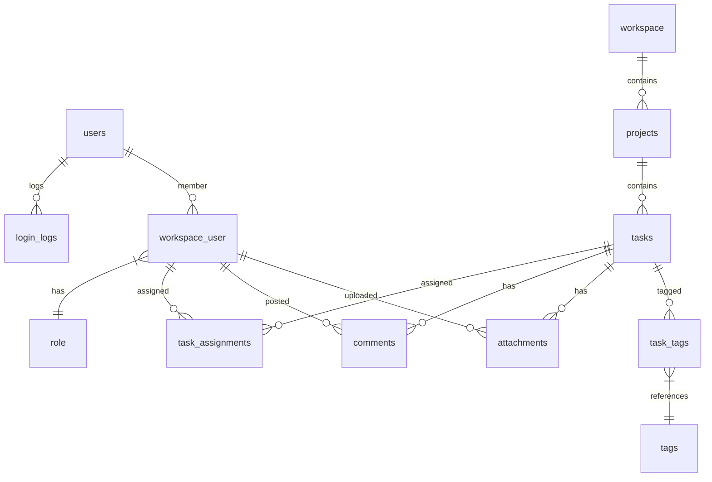

# TaskFlow API - Backend Service

## Project Purpose

TaskFlow is a modern task management API designed to power collaborative project management applications. This backend service provides the core functionality for a portfolio project showcasing full-stack development skills with Angular 19 and FastAPI.

The API enables teams to:

- Create and organize projects and tasks
- Collaborate in shared workspaces
- Track task progress with workflow management
- Assign responsibilities and manage priorities
- Maintain project documentation with comments and attachments

## Key Features

| Feature                  | Description                                        | Endpoint        |
| ------------------------ | -------------------------------------------------- | --------------- |
| **Workspace Management** | Create collaborative spaces with role-based access | `/workspaces/`  |
| **Task Lifecycle**       | Full CRUD operations with status tracking          | `/tasks/`       |
| **Project Organization** | Group tasks into projects with descriptions        | `/projects/`    |
| **User Collaboration**   | Assign tasks to team members                       | `/assignments/` |
| **Comment System**       | Threaded discussions on tasks                      | `/comments/`    |
| **Tagging System**       | Categorize tasks with custom tags                  | `/tags/`        |
| **File Attachments**     | Add supporting documents to tasks                  | `/attachments/` |
| **Authentication**       | Secure JWT-based user management                   | `/auth/`        |

## Technology Stack

- **Python 3.11+** & **FastAPI**
- **SQLAlchemy** (ORM) & **Alembic** (Database Migrations)
- **PostgreSQL** (Database)
- **Pydantic** (Data Validation)
- **JWT** (Authentication) & **Bcrypt** (Password Hashing)
- **Poetry** (Dependency Management)

## Getting Started

### Prerequisites

- Python 3.11+
- Poetry
- Docker (for running the database)

### Installation & Setup

1.  **Clone the repository:**
    ```bash
    git clone https://github.com/your-username/taskflow-api.git
    cd taskflow-api
    ```

2.  **Start the database container:**
    ```bash
    docker-compose up -d
    ```

3.  **Install dependencies:**
    ```bash
    poetry install
    ```

4.  **Activate the virtual environment:**
    ```bash
    poetry shell
    ```

5.  **Set up environment variables:**
    ```bash
    cp .env.example .env
    ```

6.  **Apply database migrations:**
    ```bash
    alembic upgrade head
    ```

7.  **Run the development server:**
    ```bash
    uvicorn app.main:app --reload
    ```

### API Documentation

Once the server is running, the interactive documentation is available at:

-   **Swagger UI:** [http://localhost:8000/docs](http://localhost:8000/docs)
-   **Redoc:** [http://localhost:8000/redoc](http://localhost:8000/redoc)

## Database Migrations (Alembic)

Alembic is used to manage and version the database schema. When you make changes to the SQLAlchemy models in `app/db/models/`, you must create a new migration script.

1.  **Generate a new migration script:**

    After changing a model, run this command. Alembic will automatically detect the changes and generate the script.

    ```bash
    poetry run alembic revision --autogenerate -m "A descriptive message about the changes"
    ```

2.  **Apply the migration:**

    To apply the newly created migration (and any pending ones) to the database, run:

    ```bash
    poetry run alembic upgrade head
    ```

3.  **Downgrade a migration (if needed):**

    To revert the last migration, you can use:

    ```bash
    poetry run alembic downgrade -1
    ```

## Development Roadmap

This section outlines the plan for developing the project features.

### Phase 1: Foundation (In Progress)

-   [x] **Project Scaffolding:** Initial FastAPI setup, modular structure.
-   [x] **Authentication:** Implement user registration and JWT-based login.
-   [x] **Database Migrations:** Configure and establish Alembic for schema management.
-   [ ] **Testing Foundation:** Write initial tests for the authentication endpoints to create a safety net.

### Phase 2: Core Features

-   [ ] **Workspace Management (`/workspaces/`)**
    -   [ ] **Task:** Create `Workspace` model and relationships.
    -   [ ] **Task:** Develop Pydantic schemas for Workspace CRUD.
    -   [ ] **Task:** Implement `workspace_service.py` with business logic.
    -   [ ] **Task:** Create API routes for workspace management.
-   [ ] **Project Management (`/projects/`)**
    -   [ ] **Task:** Create `Project` model and relationships.
    -   [ ] **Task:** Develop Pydantic schemas for Project CRUD.
    -   [ ] **Task:** Implement `project_service.py`.
    -   [ ] **Task:** Create API routes.
-   [ ] **Task Lifecycle Management (`/tasks/`)**
    -   [ ] **Task:** Create `Task` model and relationships.
    -   [ ] **Task:** Develop Pydantic schemas for Task CRUD.
    -   [ ] **Task:** Implement `task_service.py`.
    -   [ ] **Task:** Create API routes.

### Database Schema

